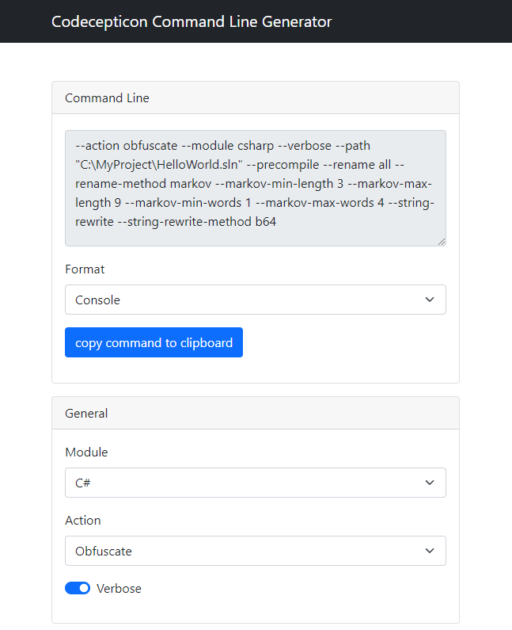
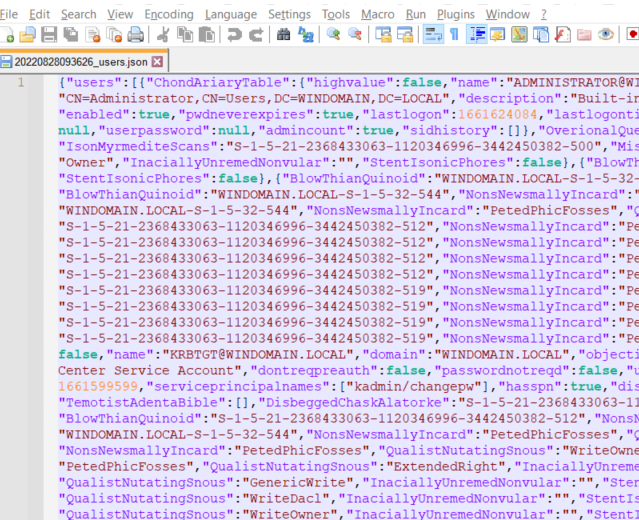
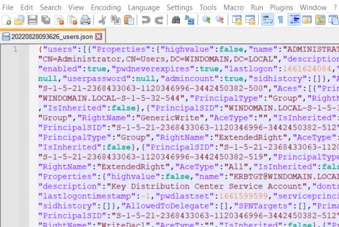

# Codecepticon Functionality

## Contents

* [Working with Codecepticon](#working-with-codecepticon)
    * [Command Line Generator HTML](../CommandLineGenerator.html)
* [What are Profiles?](#what-are-profiles)
* [String Obfuscation](#string-obfuscation)
    * [Templates](#templates)
    * [Base64](#base64)
    * [XOR Encryption](#xor-encryption)
    * [Single Substitution](#single-substitution)
    * [Group Substitution](#group-substitution)
    * [External File](#external-file)
* [Identifier Obfuscation](#identifier-obfuscation)
    * [Random](#random)
    * [No Twins](#no-twins)
    * [Dictionary](#dictionary)
    * [Markov (auto-generated English looking words)](#markov)
* [Supported Identifiers](#supported-identifiers)
    * [C#](#c)
    * [VBA](#vba)
    * [PowerShell](#powershell)
* [Signing Executables](#signing-executables)
    * [Generating Certificates](#generating-certificates)
    * [Signing](#signing)
* [Mapping](#mapping)
    * [Unmapping](#unmapping)

## Working with Codecepticon

There are two ways to use Codecepticon, either by putting all arguments in the command line or by passing a single XML configuration file. Due to the high level of supported customisations, It's not recommended manually going through `--help` output to try and figure out which parameters to use and how. Use [CommandLineGenerator.html](../CommandLineGenerator.html) and generate your command quickly:



The command generator's output format can be either `Console` or `XML`, depending what you prefer. Console commands can be executed as:

```
Codecepticon.exe --action obfuscate --module csharp --verbose ...etc
```

While when using an XML config file, as:

```
Codecepticon.exe --config C:\Your\Path\To\The\File.xml
```

## What are Profiles?

As each codebase is unique and special in its own way and due to Codecepticon rewriting the whole of it, very often there are manual tweaks that need to be made in order to get the target successfully compiled, or we may want to make some targeted changes that only apply to a specific project. This is where profiles come in, as they offer the ability to do just that - and at the moment the following profiles are available:

* Certify
* Rubeus
* Seatbelt
* SharpChrome (this takes way too long due to integrating an implementation of SQLite)
* SharpDPAPI
* SharpHound
* SharpView

<span style="color: red">!</span> Using a profile **does not mean** that you won't need to set any additional settings like character sets, what to rename, whether to rewrite strings etc - it only means that additional steps will be taken to ensure a successful end result.

More profiles will be added over time and will be based on tool popularity and requests, so for example if you often use something from SharpCollection that needs a bit of manual tweaking to get it over the line, create an issue requesting it to be supported. If you'd like to create a pull request, even better - but have a look at the [Contributions](../README.md#contributions) section first.

## String Obfuscation

Currently there are 4 different methods of obfuscating strings, which apply to all C#, VBA, and PowerShell targets.

### Templates

For each string obfuscation method there is custom code injected into the target project/script in order to deobfuscate the strings upon execution. This code is located in the `./Templates` folder and therefore can be edited freely - but keep in mind that those will be overwritten if you do a `git pull` in the future.

In C#, this code is added as a new file in the project's root folder, while in VBA/PowerShell it's added at the bottom of the script.

### Base64

Strings are encoded using Base64. That's it!

### XOR Encryption

Strings are obfuscated using basic XOR encryption and the key is being randomised for each string instead of having "one key to rule them all".

### Single Substitution

Simple [Substitution Cipher](https://en.wikipedia.org/wiki/Substitution_cipher) that is randomised on each Codecepticon run.

### Group Substitution

Similar to the [Single Substitution](#single-substitution) but each ASCII is replaced by a group of strings. For example, if the `Character Set` is set to `abcdef` and the `Length` to `4`, the result will be something like:

```
0 => 'abfe'
1 => 'beda'
2 => 'bbea'
3 => 'aaaa'
...
254 => 'bbbb'
255 => 'asdf'
```

### External File

All strings from the target are moved to an external file after being encoded with Base64 (to deal with multi-line strings). The way they are accessed is by referencing the line number in the text file, for example `GetMySecretString(77)` would retrieve line 76 (index starts at 0) from the external file, decode it, and return it.

The default behaviour of loading the external file is to look for it in the application's/script's folder - if that needs to be changed update the obfuscated result to reference the location that is required. For C# projects, this code is located in the root folder, while in VBA/PowerShell it's at the bottom of the script.

## Identifier Obfuscation

Just like with string obfuscation, the techniques used to generate identifier names (function names, variables, parameters, etc) are shared across all modules. Also, there are more restrictions on what the new names can be, for instance variables cannot begin with a number, can't have spaces, special characters, etc. So it's best to always restrict the character set to [A-Za-z].

### Random

Generates random names from the charset and length given - for instance if the `Character Set` is set to `abcdef` and the `Length` to `8`, the result will be something like:

```
MyFunction => 'abbeedaa'
OtherFunction => 'aaaabbbb'
SomeVariable => 'ffeeaacc'
...
```

### No Twins

Identical obfuscation to [Random](#random) but it will avoid using two consecutive characters, for example you will never see `aabbccdd` and will get `abababab` instead.

### Dictionary

The dictionary method will work by either specifying a file that contains random words (one per line) or a comma-separated string. Words are not used individually, but you have to define the number of words that will be concatenated. Better illustrated with an example, assuming you have the following dictionary file:

```
Monday
Tuesday
Wednesday
Thursday
Friday
Saturday
Sunday
```

And you have set your rename length to `3`. All of the obfuscated values will be words from the dictionary concatenated in 3s:

```
MyFunction => 'MondayTuesdayFriday'
OtherFunction => 'TuesdayTuesdaySaturday'
SomeVariable => 'WednesdayFridaySunday'
...
```

If you do not specify a rename length, then the concatenated length will vary from 2 to 16. You don't have to worry about not having enough words in the dictionary to cover all of the data you want to obfuscate (depending on the target), if the keyspace is not enough, Codecepticon will display an error and exit (to avoid an infinite loop).

### Markov

Functionality is identical to [Dictionary](#dictionary) but all the words are auto-generated instead of providing a file/words. At the moment, the file used to train the Markov generator is `./Templates/markov-english-words.txt` and is used every time you select `markov` as your renaming method. The reasons behind this are:

1. The time required to train the generator and the time required to load pre-generated data into memory, is almost the same.
2. By training the generator from a file every time, it would be easier to add a parameter to load a custom dictionary/language in the future, if this feature is popular.

There are configuration settings where the min/max length of each generated word, and the min/max words that are concatenated are defined.

Some may say "so if you already have a full dictionary, why don't you just use random words from there instead of generating them?" - the answer is very simple - "Where's the fun in that?!".

## Supported Identifiers

All variable names, function names, namespaces, properties, parameters etc are referred to as "identifiers". However, due to restrictions of the analysers depending on the module (C#, VBA, PowerShell) the options to obfuscate identifiers will vary. For instance, C# allows more granular access to VBA and PowerShell.

### C#

The level of customisation supported by the C# module is:

* Namespaces
* Classes
* Enums
* Functions
* Properties
* Parameters
* Variables
* Structs
* Command Line _(only for targets that have a pre-existing Profile - like SharpHound, Rubeus, etc)_

This means that it is possible to choose which identifiers should be obfuscated.

### VBA

At the moment the VBA obfuscation is "all-or-nothing" as ANTLR does not provide an easy way to categorise them. For instance:

* You can retrieve the names of all the functions in the target.
* You can retrieve where those names are used.
* But there could be a variable with the same name as well in the project.
* ANTLR (or the VB6 grammar used) doesn't provide a reliable way of telling if an identifier is a function call, a variable, a parameter, etc.

### PowerShell

The level of customisation supported by the PowerShell module is: 

* Functions
* Variables / Parameters

These restrictions exist for similar reasons as to the ones under [VBA](#vba).

## Signing Executables

### Generating Certificates

Codecepticon can be used to generate code signing certificates - which of course will be self-signed. The main requirement is that the Subject and Issuer are set to valid strings as those will be parsed by BouncyCastle during generation. It is also possible to copy the Subject and Issuer from existing files, by using the `--copy-from` argument and then passing an existing signed file.

### Signing

Once a PFX file has been created, it can be used to signed any executable you want, by using the `sign` action. Of course, it is possible to use any PFX file as long as it contains both the private and public key.

## Mapping

After each obfuscation, a mapping between the original and new names/values/etc is added into an HTML file that is easily searchable. Unless explicitly specified in the XML config or command line, this file will be created in the target's path by adding a `.html` extension in its name. So if your target is `C:\Something\Rubeus\Rubeus.sln` the mapping file will be `C:\Something\Rubeus\Rubeus.sln.html`. That file should act as a reference point for the commands you want to run, as the command line is very likely to have changed.

### Unmapping

Unmapping is the process of processing a tool's output in order to map obfuscated properties back to its original ones. Below is the output of SharpHound3  - this no longer happens in the latest version of SharpHound, but this example is good for illustration purposes:



From the above screenshot, the properties have been renamed as a result of the obfuscation. This isn't an issue with Codecepticon but a design of SharpHound3 and how it references its properties' names. So in this case `ChondAriaryTable` should be `Properties` etc. By using the mapping `html` file it is possible to revert (simple string find and replace) the obfuscated values into the original ones:



Therefore, it's **really** important to test your obfuscated result on your local environment, especially if your minimum length is small. Imagine the following scenario:

1. Your minimum rename length is 4.
2. `Properties` is renamed to `olas`.
3. You run SharpHound, and it returns users called `Nicholas`.
4. Running the unmapping tool, will replace all `Nicholas` with `NichProperties`.

The target tool's output should act like a guide when you are choosing the configuration parameters. Use longer lengths when the output needs unmapping to eliminate false positive matches, and use any length if there is no such side-effect.