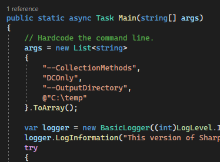

# Codecepticon Tips

This is a collection of tips to make your life easier.

## Command Line Generator

As mentioned multiple times, use the [Command Line Generator](../CommandLineGenerator.html)

## Always Test First

After obfuscating a project or a script, make sure you test locally to see that everything works. Just because it compiled does not mean that it also works like it should.

## Never Double-Obfuscate

Avoid obfuscating already obfuscated code. It may or may not work, but if you choose to go that way you're on your own!

## Git is Your Friend

Use `git` functionality to restore a project into its original state.

Clone the project you wish to obfuscate:

```
git clone https://github.com/GhostPack/Rubeus
```

Obfuscate it and check against AV/EDR. If you need to restore to its original version and obfuscate again, there is no need to clone the repo again as you can simply run the following command:

```
git clean -fd && git reset HEAD --hard
```

## Profiles

Just because you selected an obfuscation profile (like `Rubeus` or `SharpView`) does not mean you do not have to specify everything else (what and how to rename identifiers etc). Profiles are there to add the cherry on top and make tool-specific changes to ensure the end result works properly.

"Does Codecepticon only work for tools that have a profile?" - No, Codecepticon will work with any project - it's just that some projects may need one last push to get them over the line, and this is where profiles (existing or future) come in.

## Include Command Line in Target

If you find yourself in a situation where you can run an executable but you cannot use `cmd` or `powershell` to pass arguments to it, include them in the source and compile:



## Get Rid of Unused Code

Usually you will not need the entire functionality that tools like `Rubeus`, `SharpHound`, or `SharpView` have to offer, however the larger the codebase is the easier it is to fingerprint different aspects of it. Therefore, consider trimming down a project until you are left with only the required functionality.

[JetBrains Resharper](https://www.jetbrains.com/resharper/) offers functionality to identify unused methods, classes, declarations, etc, to assist with this.

## Sign Your Executables

It's quite suprising that by simply signing an executable can bypass some AV vendors, even if the certificate is invalid.